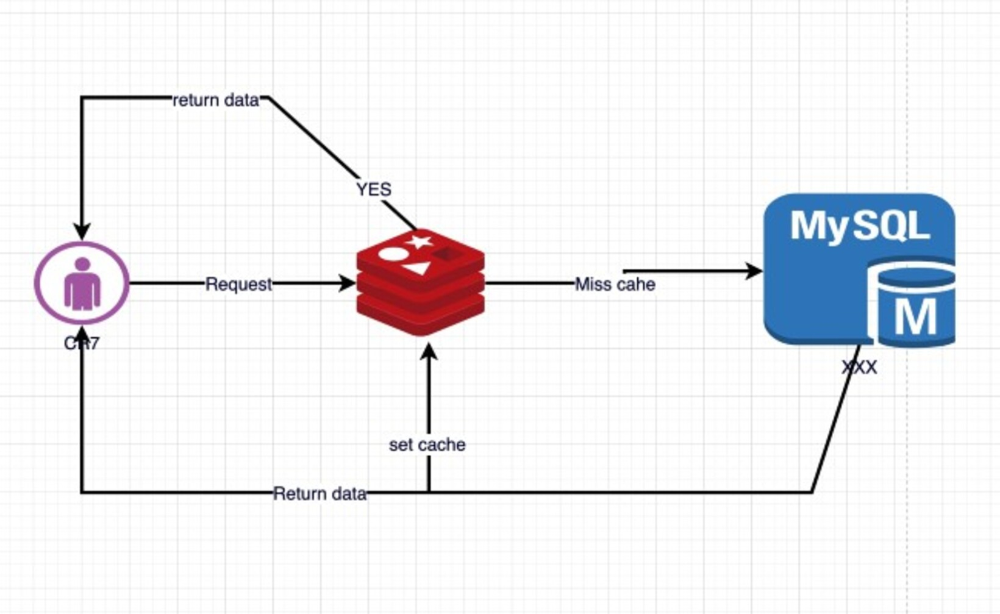
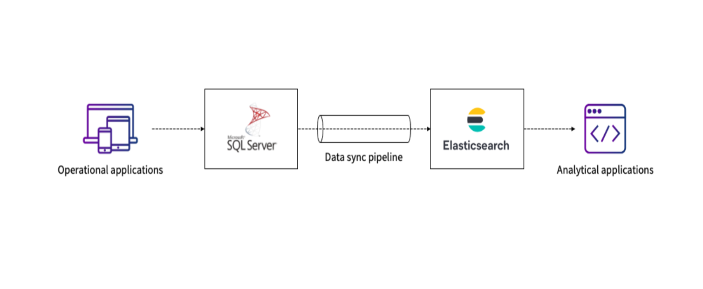
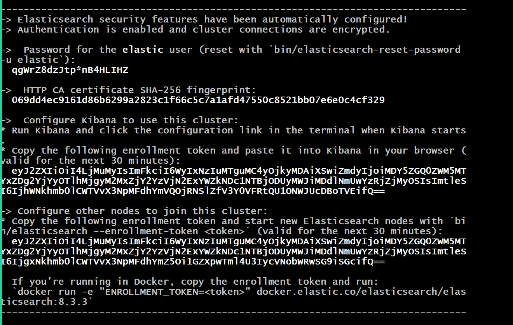

# PetProject - Using Redis, MessageBroker and ElasticSearch

## Description

This is my PetProject - A pratical Project

Tech stack: .NET 8 with simple N-Layer architecture, Module Monolith, Redis, MessageBroker (RabbitMQ) and ElasticSearch

### Redis



### MessageBroker


### ElasticSearch



## Pre-setup:

### 1. Setup Elastic Container:

Pull ElasticSearch Image for DockerHub
```
docker pull docker.elastic.co/elasticsearch/elasticsearch:8.13.2
```

Create a Docker Network
```
docker pull docker.elastic.co/elasticsearch/elasticsearch:8.13.2
```

Run ElasticSearch Container
```
docker run --name es01 --net elastic -p 9200:9200 -it -m 1GB docker.elastic.co/elasticsearch/elasticsearch:8.13.2
```

* Note: First time run ElasticSearch Container, we need to save Authentication Info



### 2. Setup Kibana Container:

Pull Kinbana Image from DockerHub
```
docker pull docker.elastic.co/kibana/kibana:8.13.2
```

Run Kibana Container
```
docker run --name kib01 --net elastic -p 5601:5601 docker.elastic.co/kibana/kibana:8.13.2
```


## Reference:

- [ Tutorial - Sample ElasticSearch with ASP.NET ]([https://github.com/phongnguyend/Practical.CleanArchitecture](https://www.bytefish.de/blog/elasticsearch_code_search_part1_backend_elasticsearch.html))

- [ Setup - Sample Setup ElasticSearch and Kibana with Docker]([https://www.elastic.co/guide/en/elasticsearch/reference/current/docker.html])
